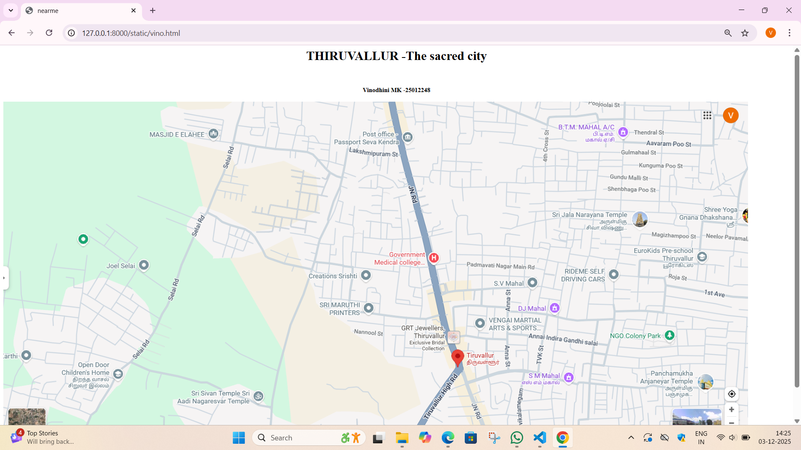
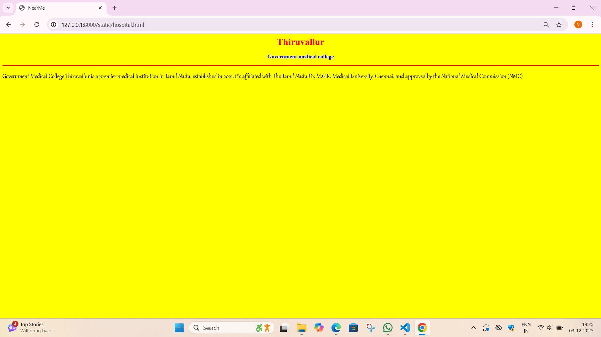
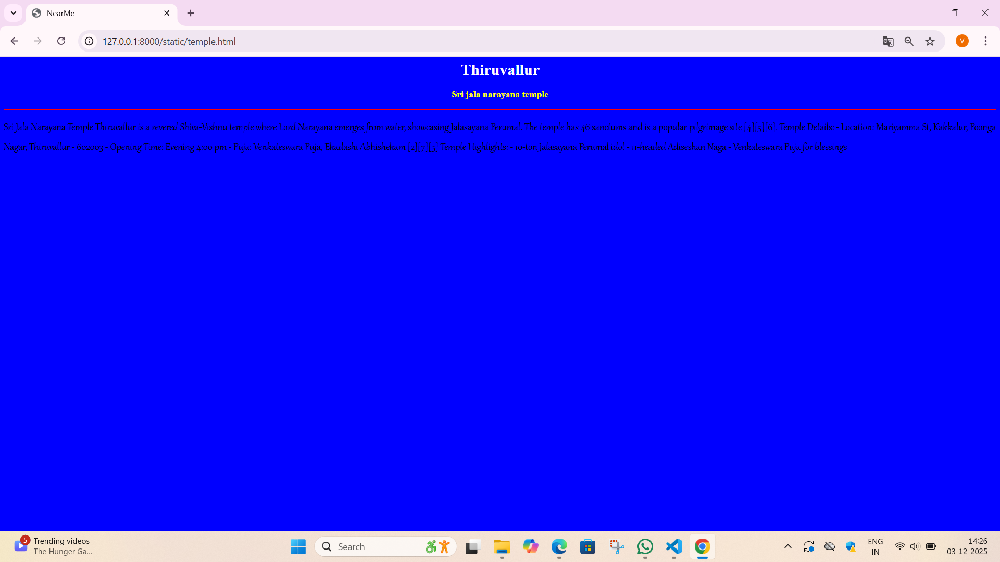
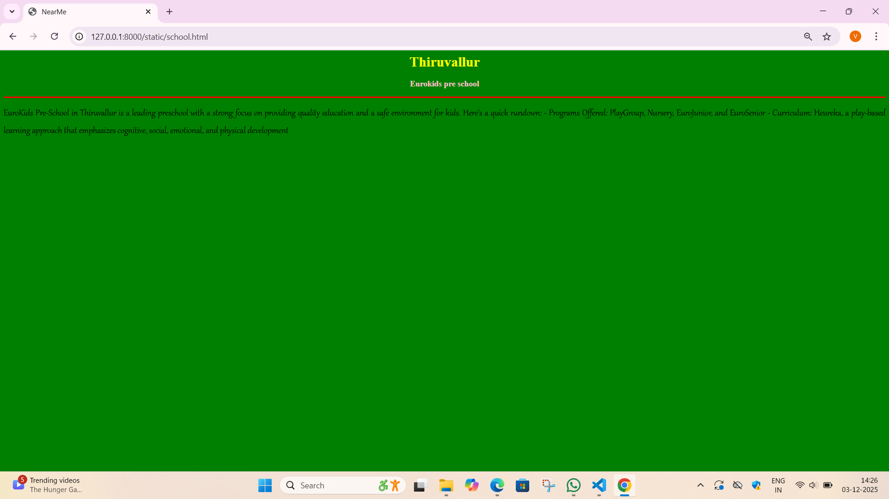
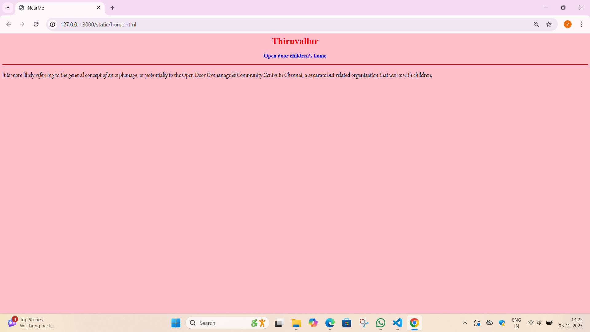
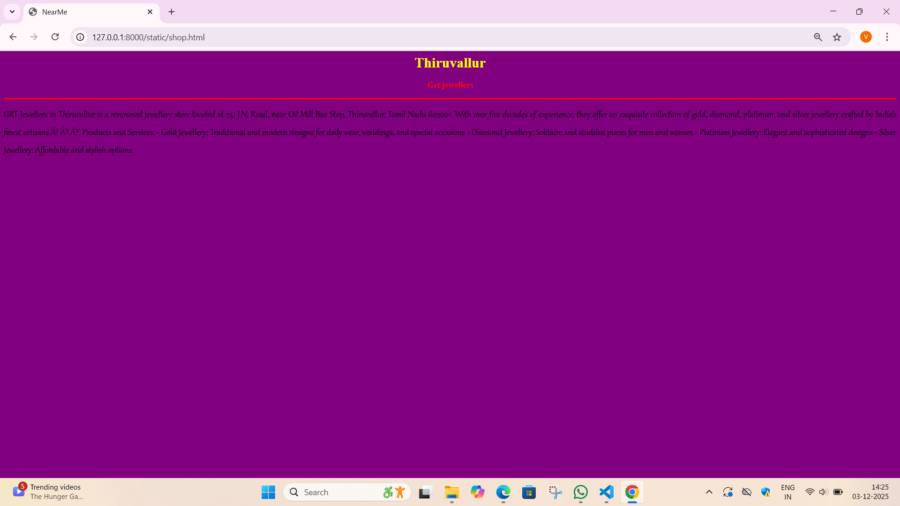

# Ex03 Places Around Me
## Date: 3.12.2025

## AIM
To develop a website to display details about the places around my house.

## DESIGN STEPS

### STEP 1
Create a Django admin interface.

### STEP 2
Download your city map from Google as an image.

### STEP 3
Insert the image using `````` tag and link it to the map.

### STEP 4
Using ```<map>``` tag name the map.

### STEP 5
Create clickable regions in the image using ```<area>``` tag.

### STEP 6
Write HTML programs for all the regions identified.

### STEP 7
Execute the programs and publish them.

## CODE
```
<html>
    <head>
        <title>nearme</title>
    </head>
    <body>
        <header>
            <h1 align="center">THIRUVALLUR -The sacred city </h1>
            <br>
            <h4 align="center">Vinodhini MK -25012248</h4>
        </header>
        

<map name="image-map">
    <area target="" alt="government medical college" title="government medical college" href="hospital.html" coords="942,368,1125,429" shape="rect">
    <area target="" alt="sri jala narayana temple" title="sri jala narayana temple" href="temple.html" coords="1390,266,1633,331" shape="rect">
    <area target="" alt="eurokids pre-school" title="eurokids pre-school" href="school.html" coords="1601,373,1789,416" shape="rect">
    <area target="" alt="open door children's home" title="open door children's home" href="home.html" coords="140,660,291,729" shape="rect">
    <area target="" alt="grt jewellers" title="grt jewellers" href="shop.html" coords="1011,562,1145,624" shape="rect">
</map>
    </body>
</html>

```
```
hospital.html

<html>
    <head>
        <title>NearMe</title>
    </head>
    <body bgcolor="yellow">
        <h1 align="center">
            <font color="red"><b>Thiruvallur</b></font>
        </h1>
        <h3 align="center">
            <font color="blue"><b>Government medical college</b></font>
        </h3>
        <hr size="3" color="red">
        <p align="justify">
            <font face="Gabriola " size="5">
           Government Medical College Thiruvallur is a premier medical institution in Tamil Nadu, established in 2021. It's affiliated with The Tamil Nadu Dr. M.G.R. Medical University, Chennai, and approved by the National Medical Commission (NMC)     

        </p>
    </body>
</html>
```
```
temple.html

<html>
    <head>
        <title>NearMe</title>
    </head>
    <body bgcolor="blue">
        <h1 align="center">
            <font color="white"><b>Thiruvallur</b></font>
        </h1>
        <h3 align="center">
            <font color="yellow"><b>Sri jala narayana temple</b></font>
        </h3>
        <hr size="3" color="red">
        <p align="justify">
            <font face="Gabriola " size="5">
          Sri Jala Narayana Temple Thiruvallur is a revered Shiva-Vishnu temple where Lord Narayana emerges from water, showcasing Jalasayana Perumal. The temple has 46 sanctums and is a popular pilgrimage site [4][5][6].

Temple Details:

- Location: Mariyamma St, Kakkalur, Poonga Nagar, Thiruvallur - 602003
- Opening Time: Evening 4:00 pm
- Puja: Venkateswara Puja, Ekadashi Abhishekam
[2][7][5]

Temple Highlights:

- 10-ton Jalasayana Perumal idol
- 11-headed Adiseshan Naga
- Venkateswara Puja for blessings      

        </p>
    </body>
</html>
```
```
school.html

<html>
    <head>
        <title>NearMe</title>
    </head>
    <body bgcolor="green">
        <h1 align="center">
            <font color="yellow"><b>Thiruvallur</b></font>
        </h1>
        <h3 align="center">
            <font color="pink"><b>Eurokids pre school</b></font>
        </h3>
        <hr size="3" color="red">
        <p align="justify">
            <font face="Gabriola " size="5">  
        EuroKids Pre-School in Thiruvallur is a leading preschool with a strong focus on providing quality education and a safe environment for kids. Here's a quick rundown:

- Programs Offered: PlayGroup, Nursery, EuroJunior, and EuroSenior
- Curriculum: Heureka, a play-based learning approach that emphasizes cognitive, social, emotional, and physical development
        </p>
    </body>
</html>
```
```
home.html

<html>
    <head>
        <title>NearMe</title>
    </head>
    <body bgcolor="pink">
        <h1 align="center">
            <font color="red"><b>Thiruvallur</b></font>
        </h1>
        <h3 align="center">
            <font color="blue"><b>Open door children's home</b></font>
        </h3>
        <hr size="3" color="red">
        <p align="justify">
            <font face="Gabriola " size="5">
                It is more likely referring to the general concept of an orphanage, or potentially to the Open Door Orphanage & Community Centre in Chennai, a separate but related organization that works with children,

        </p>
    </body>
</html>
```
```
shop.html

<html>
    <head>
        <title>NearMe</title>
    </head>
    <body bgcolor="purple">
        <h1 align="center">
            <font color="yellow"><b>Thiruvallur</b></font>
        </h1>
        <h3 align="center">
            <font color="red"><b>Grt jewellers</b></font>
        </h3>
        <hr size="3" color="red">
        <p align="justify">
            <font face="Gabriola " size="5">
         GRT Jewellers in Thiruvallur is a renowned jewellery store located at 74, J.N. Road, near Oil Mill Bus Stop, Thiruvallur, Tamil Nadu 602001. With over five decades of experience, they offer an exquisite collection of gold, diamond, platinum, and silver jewellery crafted by India's finest artisans ¹ ² ³.

Products and Services:

- Gold Jewellery: Traditional and modern designs for daily wear, weddings, and special occasions
- Diamond Jewellery: Solitaire and studded pieces for men and women
- Platinum Jewellery: Elegant and sophisticated designs
- Silver Jewellery: Affordable and stylish options       

        </p>
    </body>
</html>
```


## OUTPUT








## RESULT
The program for implementing image maps using HTML is executed successfully.
